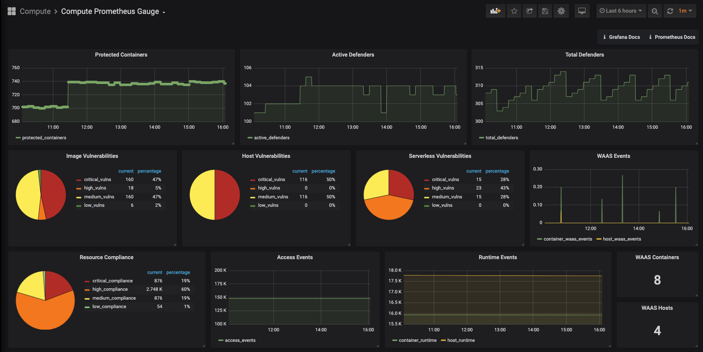
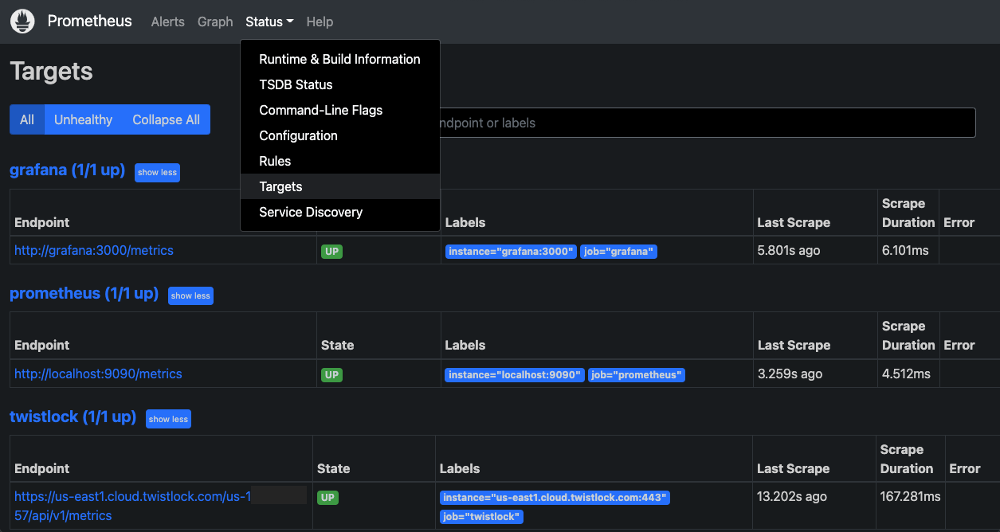
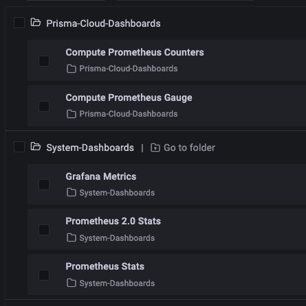
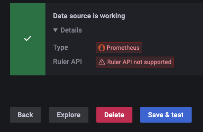

# Prisma Cloud metrics and monitoring

 

## !!! BY DEFAULT PROMETHEUS IS NOT AUTHENTICATED !!!
Be sure to secure Prometheus, unauthenticated by default

## Configure and Deploy
1. Pre-deployment configuration
    * Prometheus
        * Edit [./prometheus/prometheus.yml](./prometheus/prometheus.yml) with your `Path to Console` and your `access/secret` key
    * Grafana
        * (Optional) Append new data sources in [/grafana/provisioning/datasources/all_sources.yml](./grafana/provisioning/datasources/all_sources.yml)
        * (Optional) Add new `.json` files of dashboards in [./grafana/dashboards](./grafana/dashboards/)
1. Deployment
    * Run `docker-compose up -d`
    * Verify both **Prometheus** and **Grafana** containers are started successfully and reachable
        * If running locally, should be *http://localhost:9090/* for Prometheus, and *http://localhost:3000/* for Grafana
1. Verify
    * You should now see dashboards like below!
    

## Troubleshooting
### Prometheus
* First check the Prometheus `Targets` page, and see if any status errors are there
    **Error** | **Info**
    ------------ | -------------
    502 | The  `metrics`  endpoint set on the  **Path to Console**  in [ prometheus.yml ]( ./prometheus/prometheus.yml ) is likely incorrect 
    401 |  The `access/secret` key either doesn't have permissions or is incorrect

### Grafana
* Can't see dashboards: Check under "Dashboards > Browse" and expand the 2 folders:

* No data in dashboards: Go to "Configuration > Data Sources > Prometheus", scroll to the bottom and click "Save & test"

## License
This project is licensed under the MIT License - see the [LICENSE](./LICENSE) file for details
